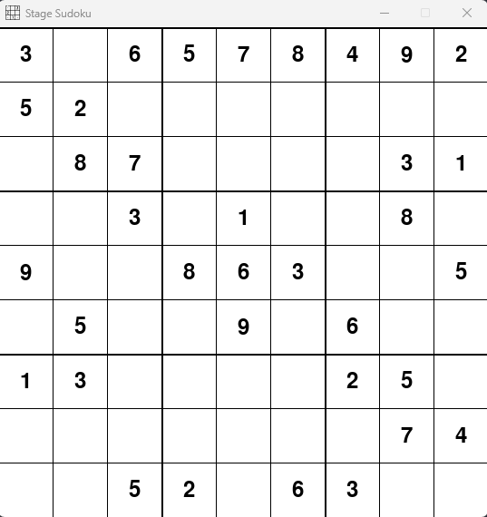
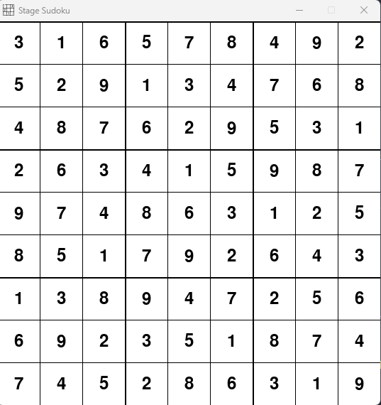

# Sudoku Solver - Stage Consulting Test

## Description
This project aims to solve a specific 9x9 Sudoku puzzle in a matrix defined by the variable GRID. The script is designed to identify when a solution is not possible and provides details on errors, such as repeated numbers in the same row or column, their positions, and directions.

## Sudoku Rules
Sudoku is a number-placement puzzle. The objective is to fill a 9x9 grid with digits so that each column, each row, and each of the nine 3x3 subgrids (also known as regions or boxes) contain all of the digits from 1 to 9.

## How to Install
1. Clone the repository: `git clone https://github.com/noccss/Stage_Sudoku_Test.git`
2. Install dependencies with Makefile: `make install`

### Alternative Installation without Make
1. Clone the repository: `git clone https://github.com/noccss/Stage_Sudoku_Test.git`
2. Install the dependency with pip: `pip install pygame`

## How to Run the Application
- Using Make: `make run`
- Without Make: `python ./main.py`

## Usage
Provide detailed instructions on how to use the application, including how to input initial Sudoku values or any customization options.

## Contact
For more information about the project, you can send an email to: [nicolas.olicarvalho@gmail.com](mailto:nicolas.olicarvalho@gmail.com).

## Images of the Application


*Description: An example of the initial Sudoku puzzle.*


*Description: The Sudoku puzzle after being successfully solved.*

## Sudoku Rules (Detailed)
- Each row must contain all of the digits from 1 to 9 without repetition.
- Each column must contain all of the digits from 1 to 9 without repetition.
- Each of the nine 3x3 subgrids must contain all of the digits from 1 to 9 without repetition.

## Sudoku Grid
```python
GRID = [
    [3, 0, 6, 5, 7, 8, 4, 9, 2],
    [5, 2, 0, 0, 0, 0, 0, 0, 0],
    [0, 8, 7, 0, 0, 0, 0, 3, 1],
    [0, 0, 3, 0, 1, 0, 0, 8, 0],
    [9, 0, 0, 8, 6, 3, 0, 0, 5],
    [0, 5, 0, 0, 9, 0, 6, 0, 0],
    [1, 3, 0, 0, 0, 0, 2, 5, 0],
    [0, 0, 0, 0, 0, 0, 0, 7, 4],
    [0, 0, 5, 2, 0, 6, 3, 0, 0]
]
